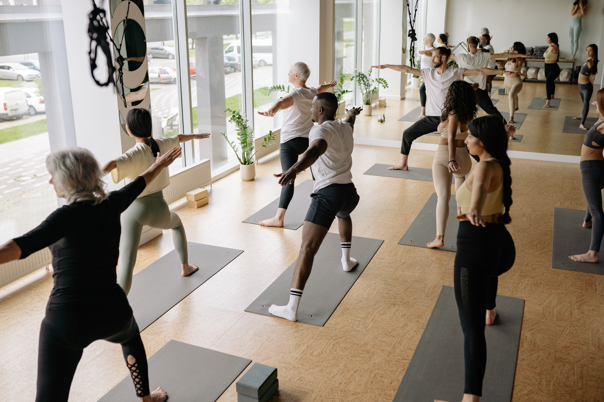
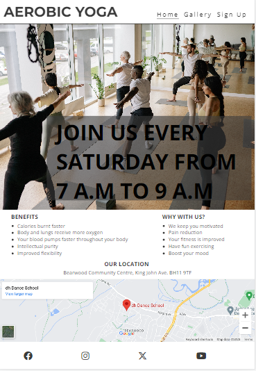
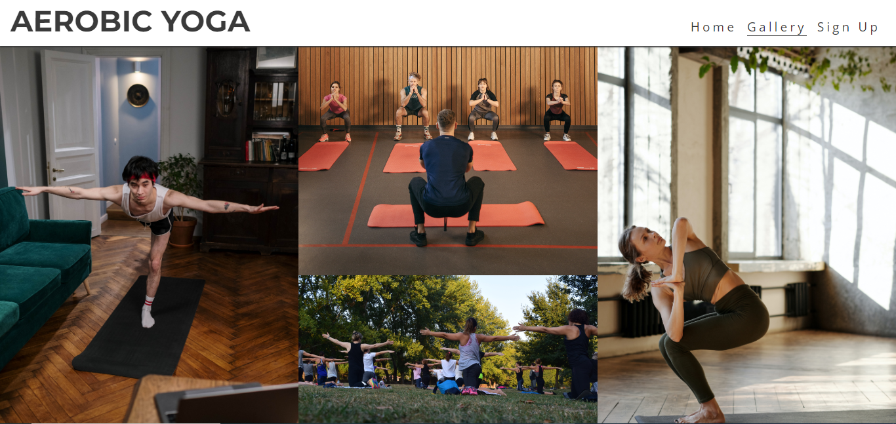

# AEROBIC YOGA CI PROJECT 1

The idea behind this project, is to introduce aerobics to yoga exercise, to make it even more fun to partake in. This is done by combining some aerobic exercises, and, also changing certain yoga exercises into steps of dance moves with music often playing in the background. This option is for people who want to have fun while exercising.

# Table of content

- [AEROBIC YOGA CI PROJECT 1](#aerobic-yoga-ci-project-1)
- [Table of content](#table-of-content)
- [Design](#design)
- [Features](#features)
  - [Existing Features](#existing-features)
    - [Languages Used](#languages-used)
    - [Navigation](#navigation)
    - [Home Page main photo](#home-page-main-photo)
    - [Home Page](#home-page)
      - [Benefits?](#benefits)
      - [Why with us?](#why-with-us)
      - [Our location?](#our-location)
      - [Gallery page](#gallery-page)
      - [Sign up page](#sign-up-page)
    - [Footer](#footer)
  - [Future Features](#future-features)
- [Testing](#testing)
  - [Validator Testing](#validator-testing)
  - [Unfixed Bugs](#unfixed-bugs)
  - [Libraries and Programs Used](#libraries-and-programs-used)
- [Deployment](#deployment)
- [Credits](#credits)
  - [Content](#content)
  - [Media](#media)

# Design

The choice of color, background-color, font and font-family where chosen for simplicity and, also for how visually appealing they can be to site users.

# Features

## Existing Features

### Languages Used

- HTML5
- CSS3

### Navigation

There are three navigation links in this project, and they are located at the top right side of the users screen. However, for phone screen, because of its size the navigation link has been compessed into an icon (bars), so that, when clicked the users have access to these navigation links. They can be accessed easily, and also there to enable users navigate between the three pages of this website.

### Home Page main photo

A main photo is used in the index page as the hero image. This is done to draw the attention of the site users to what happens in our studio. The goal is to gain their approval of what we do, and, for them to sign up.

### Home Page

This page engages with our site users, by providing information about what we do, its benefits, why they should sign up, our location and, also our social handles.

#### Benefits?

This section provides our site users with some major benefits of aerobic yoga to them, so as to get them to sign up..

#### Why with us?

This section has been included to gain our users trust, to enable them not only to sign up for aerobic yoga exercises, but also, for them to choose us.

#### Our location?

This section details where we meet as a group.

#### Gallery page

This page shows some images from our activities as our way of encouraging more people to exercise with us.

#### Sign up page

The sign up page is where we take information about those joining our group. This is to enable us to enrol them, and, also keep in touch with them.

### Footer

The footer section directs our site users to our social handles to keep up with updates regarding our activities.

## Future Features

- Add videos of our activities.
- Add testimonies of people, who sign up with us, on our website.

# Testing

Testing of the website was done by me. I open the link on different browsers (Chrome and MS Edge) to be certain they where rendered as I expected. Certain html contents where out of position. This was corrected using appropriate CSS styling.

I have checked to confirm that forms cannot be submitted without valid entries.

I have ensured that this project is responsive on all screens.

## Validator Testing

- HTML: No errors or warnings shown when passed via the official W3C validator:

- CSS: No errors were found when passing through the official (Jigsaw) validator:

- Lighthouse (Accessibility Audit): The page achieved a great accessibility performance:

NB: Although the above screenshots only shows the results of the home page, no errors were found on the other pages of the site and they also achieved great accessibility performance.

## Unfixed Bugs

I have found that the spacing below some of the text sections of the 'Buddhism & Meditation' page are quite large. I think that due to the way that I have designed the page by using similar classes for the text tiles to reduce on CSS coding, I had not anticipated that where there are larger blocks of text, that these sections needed to be larger for smaller screens.

I do not think that this takes too much away from the design of the website, and I am happy with how it is, but I do plan to spend some more time on website design in the the future, so I can better plan before a project to avoid this.

It is also noted that the 'Performance' measure from the Lighthouse Accessibility Audit was relatively low (63/100). This is something which I am going to look into so I can improve on it for the future.

## Libraries and Programs Used

- Github: Store Repository
- Gitpod: Create the html and css files
- Google Fonts: Font-family 'Raleway' and 'Ubuntu'
- Google Chrome Dev Tools: To aid the initial styling for media queries and testing at various screen sizes
- Microsoft Edge: Site testing on an alternative browser
- Microsoft OneNote: Planning of the project
- Font Awesome: Social media icons
- Am I Responsive: Screenshots of the final project for the README file

# Deployment

The site was deployed to GitHub pages. The steps to deploy are as follows:

  1. In the GitHub repository, navigate to the Settings tab.
  2. From the settings tab, select the 'Pages' tab in the 'Code and Automation' section.
  3. From the source section drop-down menu, select the 'Main' branch.
  4. Once the 'Main' branch has been selected, the page will be automatically refreshed with a detailed ribbon display to indicate the successful deployment.

The live link for the site can be found here - <https://tuckerfaulk.github.io/sub30s-buddhist-group-project/>

# Credits

I have really enjoyed the Code Institute course up till now, and I am looking forward to the next units of the course. I wanted to thank the Slack Community for their support learning the content and my Mentor Martina for her guidance with this project and assurances that creating a website is not as scary as I initially thought.

As a starting point I looked at the Coders Coffee and Love Running projects.

- From the Love Running Project, I took inspiration for the header, hero banner, footer and form.
- From the Coders Coffee Project, I took inspiration from in my 'What we do?' section.

## Content

Links have been provided for where the text from the following sections have been taken from:

1. What is Buddhism? [Link](https://thebuddhistcentre.com/buddhism)

2. Who was the Buddha? [Link](https://thebuddhistcentre.com/text/who-was-buddha)

3. What is Meditation? [Link](https://thebuddhistcentre.com/text/meditation)

## Media

Images:

All images were sources from pexels.com:

- Pink Lotus Flower - Photo Contributor: [Pixabay](https://www.pexels.com/photo/aquatic-bloom-blooming-blossom-158465/)
- Rock Formation - Photo Contributor: [nicollazzi xiong](https://www.pexels.com/photo/four-rock-formation-668353/)
- Woman Meditating - Photo Contributor: [Oluremi Adebayo](https://www.pexels.com/photo/woman-meditating-in-the-outdoors-2908175/)
- Monks Meditating - Photo Contributor: [Pixabay](https://www.pexels.com/photo/people-festival-sitting-freedom-50709/)
- Stack of Stones - Photo Contributor: [mali maeder](https://www.pexels.com/photo/stack-of-stones-1278952/)
- Woman Meditating in Bedroom - Photo Contributor: [Andrea Piacquadio](https://www.pexels.com/photo/woman-meditating-in-bedroom-3772612/)
- Buddha Statue - Photo Contributor: [David Bartus](https://www.pexels.com/photo/buddha-statue-2873473/)
- Tibetan Singing Bowls - Photo Contributor: [Magicbowls] (<https://www.pexels.com/photo/tibetan-singing-bowls-3543912/>)

Youtube Videos:

- [Metta Bahavana Meditation Video](https://www.youtube.com/watch?v=grJ2wh7nk-E)
- [Mindfulness of Breathing Meditation Video](https://www.youtube.com/watch?v=32elVeLKFAI)
